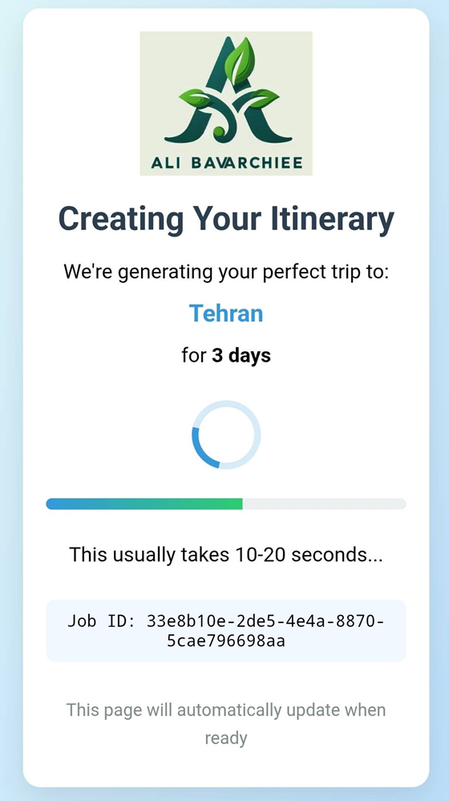

# AI Itinerary Generator


A cloud-based travel itinerary generator that creates personalized travel plans using OpenAI's GPT models and stores results in Firestore. This project generates detailed, day-by-day itineraries based on destination and trip duration.

## Features

- 🚀 Generate multi-day travel itineraries in seconds
- 🌐 Web UI and API access
- 🔄 Background processing for AI generation
- 💾 Firestore persistence
- 🔔 Automatic status updates
- 🎨 Beautiful itinerary display
- ✅ Input validation and error handling

## Architecture

```
ai-itinerary-generator/
├── main.py                  # Flask app and Cloud Function entry point
├── firestore.py             # Firestore initialization and helpers
├── openai_client.py         # OpenAI API integration
├── models.py                # Pydantic data models
├── requirements.txt         # Python dependencies
├── .env                     # Environment variables (template)
├── static/                  # Static assets (CSS)
│   └── style.css
├── templates/               # HTML templates
│   ├── index.html           # Main form UI
│   ├── itinerary.html       # Itinerary display
│   ├── processing.html      # Loading screen
│   └── error.html           # Error page
└── README.md
```

## Architectural Choices

### Server Framework
- **Flask**: Chosen for its simplicity, flexibility, and compatibility with Google Cloud Functions
- **WSGI Standard**: Ensures portability across different hosting environments

### Data Handling
- **Pydantic Models**: For robust input validation and schema definition
- **Firestore**: Serverless document database with real-time capabilities
- **Background Processing**: Uses threading to handle AI generation asynchronously

### Error Handling
- Comprehensive error logging at all stages
- User-friendly error pages with actionable information
- Status-based error categorization (processing, completed, failed)

### UI/UX
- Progressive enhancement approach
- Auto-refresh status pages
- Responsive design for all device sizes
- Client-side validation for immediate feedback

### Prompt Design
The OpenAI prompt is carefully crafted to ensure consistent JSON output:

```prompt
Generate a detailed {days}-day travel itinerary to {destination}. 
Include diverse activities with specific locations and times.

Output must be in this EXACT JSON format:
[
  {
    "day": 1,
    "theme": "Cultural Exploration",
    "activities": [
      {
        "time": "9:00 AM",
        "description": "Visit local museum",
        "location": "National Museum of History"
      }
    ]
  }
]
```

Key features of the prompt:
- Clear instruction for detailed itinerary
- Structured JSON output requirement
- Example format for consistency
- Theme-based daily organization
- Specific activity time formatting

## Setup Instructions

### 1. Prerequisites

- Python 3.9+
- Google Cloud account
- Firebase project with Firestore enabled
- OpenAI API key (from [OpenAI Platform](https://platform.openai.com/))
- Git (for version control)

### 2. Clone Repository

```bash
git clone https://github.com/yourusername/ai-itinerary-generator.git
cd ai-itinerary-generator
```

### 3. Install Dependencies

```bash
pip install -r requirements.txt
```

### 4. Environment Variables

Create a `.env` file in the project root with the following content:

```env
# OpenAI configuration
OPENAI_API_KEY=your_openai_api_key_here
OPENAI_MODEL=gpt-4o  # or gpt-3.5-turbo, gpt-4, etc.
OPENAI_TEMPERATURE=0.7  # creativity level (0-2)

# Firebase configuration
GOOGLE_APPLICATION_CREDENTIALS=path/to/your/service-account-file.json
```

-----
### 5. Code Structure Deep Dive

Here's a detailed breakdown of each Python script in the project, their responsibilities, and how they interconnect to form the complete application:

## 1. `main.py` - Cloud Function Entry Point
**Responsibilities**:
- Application initialization and configuration
- Request routing and handling
- Input validation and job management
- Background processing orchestration
- Response generation

**Key Components**:
```python
# Initialize Flask app and Firestore
app = Flask(__name__, static_folder='static', template_folder='templates')
db = init_firestore()

# Form submission endpoint
@app.route('/generate', methods=['GET', 'POST'])
def generate_form():
    # 1. Validate inputs
    # 2. Create job ID
    # 3. Save initial Firestore document
    # 4. Start background thread
    # 5. Redirect to status page

# Itinerary status endpoint
@app.route('/itineraries/<job_id>', methods=['GET'])
def get_itinerary(job_id):
    # 1. Retrieve document from Firestore
    # 2. Format timestamps
    # 3. Render appropriate template based on status

# Cloud Function entry point
def app_function(request):
    return app(request.environ, lambda status, headers: None)
```

**Connections**:
- Uses `firestore.init_firestore()` to initialize database connection
- Calls `openai_client.generate_itinerary()` in background threads
- Utilizes `models.ItineraryDocument` for data validation
- Renders templates from `templates/` directory
- Serves static files from `static/` directory

---

## 2. `firestore.py` - Firestore Initialization and Helpers
**Responsibilities**:
- Firestore client initialization
- Document creation and updates
- Timestamp handling

**Key Components**:
```python
from google.cloud import firestore

def init_firestore():
    """Initialize and return Firestore client"""
    return firestore.Client()

def save_initial_doc(db, job_id, destination, duration):
    """Create initial processing document"""
    db.collection("itineraries").document(job_id).set({
        "status": "processing",
        "destination": destination,
        "durationDays": duration,
        "createdAt": firestore.SERVER_TIMESTAMP,
        "completedAt": None,
        "itinerary": None,
        "error": None
    })

def update_result_doc(db, job_id, result):
    """Update document with generation results"""
    result["completedAt"] = firestore.SERVER_TIMESTAMP
    db.collection("itineraries").document(job_id).update(result)
```

**Connections**:
- Called by `main.py` for all database operations
- Uses Firestore's SERVER_TIMESTAMP for accurate timing
- Creates and updates documents in the "itineraries" collection
- Handles both success and error document updates

---

## 3. `openai_client.py` - LLM Call Logic
**Responsibilities**:
- OpenAI API configuration
- Prompt engineering
- Response parsing and validation
- Error handling for AI generation

**Key Components**:
```python
import openai
import os
import json
import logging
from dotenv import load_dotenv
from models import Activity, Day
from pydantic import ValidationError

load_dotenv()
openai.api_key = os.getenv("OPENAI_API_KEY")

def generate_itinerary(destination: str, days: int) -> list:
    # 1. Construct the prompt
    prompt = f"Generate a detailed {days}-day travel itinerary to {destination}..."
    
    # 2. Call OpenAI API
    response = openai.ChatCompletion.create(
        model=os.getenv("OPENAI_MODEL", "gpt-4o"),
        messages=[{"role": "user", "content": prompt}],
        temperature=float(os.getenv("OPENAI_TEMPERATURE", 0.7))
    
    # 3. Extract and parse JSON response
    content = response['choices'][0]['message']['content']
    json_start = content.find('[')
    json_end = content.rfind(']') + 1
    json_str = content[json_start:json_end]
    itinerary_data = json.loads(json_str)
    
    # 4. Validate response with Pydantic models
    validated_days = []
    for day_data in itinerary_data:
        activities = [Activity(**act) for act in day_data["activities"]]
        day = Day(day=day_data["day"], theme=day_data["theme"], activities=activities)
        validated_days.append(day.dict())
    
    return validated_days
```

**Connections**:
- Loads environment variables from `.env` file
- Uses `models.Activity` and `models.Day` for response validation
- Called by background threads in `main.py`
- Implements robust error handling for API failures

---

## 4. `models.py` - Pydantic Schemas
**Responsibilities**:
- Data validation and serialization
- Define application data structures
- Enforce type constraints

**Key Components**:
```python
from pydantic import BaseModel, Field
from typing import List, Optional
from datetime import datetime

class Activity(BaseModel):
    time: str = Field(..., example="9:00 AM")
    description: str
    location: str

class Day(BaseModel):
    day: int
    theme: str
    activities: List[Activity]

class ItineraryInput(BaseModel):
    destination: str
    durationDays: int = Field(..., gt=0, le=30, 
                             description="Trip duration in days (1-30)")

class ItineraryDocument(BaseModel):
    jobId: str
    status: str  # processing, completed, failed
    destination: str
    durationDays: int
    createdAt: Optional[datetime] = None
    completedAt: Optional[datetime] = None
    itinerary: Optional[List[Day]] = None
    error: Optional[str] = None
```

**Connections**:
- Used by `main.py` for input validation (`ItineraryInput`)
- Used by `openai_client.py` for response validation (`Activity`, `Day`)
- Defines Firestore document structure (`ItineraryDocument`)
- Ensures data consistency throughout the application

---

## Application Workflow


## Key Data Flow

1. **User Input**:
   - Collected via web form or API call
   - Validated using `models.ItineraryInput`

2. **Job Creation**:
   - `main.py` creates job ID
   - `firestore.py` saves initial document with "processing" status

3. **AI Processing**:
   - Background thread calls `openai_client.generate_itinerary()`
   - Response validated with `models.Activity` and `models.Day`
   - Processed data stored via `firestore.update_result_doc()`

4. **Result Delivery**:
   - Client polls status endpoint
   - `main.py` retrieves document from Firestore
   - Data formatted using `models.ItineraryDocument`
   - Appropriate template rendered based on status

## Error Handling Strategy

1. **Input Validation**:
   - Client-side validation in browser
   - Server-side validation with Pydantic models
   - Meaningful error messages

2. **AI Generation Errors**:
   - Try/except blocks in `openai_client.py`
   - Structured error storage in Firestore
   - Specialized error templates

3. **System Failures**:
   - Comprehensive logging throughout
   - Graceful degradation in UI
   - Automatic retry mechanisms

This architecture provides a robust, scalable foundation for itinerary generation while maintaining clear separation of concerns between application components.

-----

### 6. Run Locally

```bash
python main.py
```
or

```bash
functions-framework --target=app_function
```

The application will:
- Start on port 8080
- Automatically open your browser to `http://localhost:8080`
- Show the itinerary generation form

### 7. Deploy to Google Cloud Functions

1. Install Google Cloud SDK
2. Authenticate with your Google account:
   ```bash
   gcloud auth login
   ```
3. Set your project:
   ```bash
   gcloud config set project YOUR_PROJECT_ID
   ```
4. Deploy the function:
   ```bash
   gcloud functions deploy ai-itinerary-generator \
     --runtime python310 \
     --trigger-http \
     --allow-unauthenticated \
     --entry-point app_function \
     --set-env-vars "OPENAI_API_KEY=your_key,OPENAI_MODEL=gpt-4o,GOOGLE_APPLICATION_CREDENTIALS=your-service-account.json"
   ```

## API Usage

### Generate Itinerary (cURL)

```bash
curl -X POST 'https://your-cloud-function-url/generate' \
  -H 'Content-Type: application/json' \
  -d '{
    "destination": "Paris",
    "durationDays": 5
  }'
```

### Generate Itinerary (JavaScript)

```javascript
fetch('/generate', {
  method: 'POST',
  headers: { 
    'Content-Type': 'application/json' 
  },
  body: JSON.stringify({ 
    destination: "Tokyo", 
    durationDays: 7 
  })
})
.then(response => response.json())
.then(data => {
  console.log("Job ID:", data.jobId);
  console.log("Status URL:", data.statusUrl);
})
.catch(error => console.error('Error:', error));
```

### Response Format

```json
{
  "jobId": "c8e2f1a0-...",
  "statusUrl": "/itineraries/c8e2f1a0-..."
}
```

### Check Itinerary Status

```bash
curl 'https://your-cloud-function-url/itineraries/c8e2f1a0-...'
```

## Firestore Data Model

Collection: `itineraries`

```javascript
{
  jobId: string,                   // Unique job identifier
  status: string,                  // "processing", "completed", or "failed"
  destination: string,             // Travel destination
  durationDays: number,            // Trip duration in days
  createdAt: Timestamp,            // Job creation timestamp
  completedAt: Timestamp | null,   // Completion timestamp
  itinerary: array | null,         // Generated itinerary
  error: string | null             // Error message if failed
}
```

### Itinerary Structure

```javascript
itinerary: [
  {
    day: number,                   // Day number (1, 2, 3...)
    theme: string,                 // Daily theme
    activities: [
      {
        time: string,              // Activity time (e.g., "9:00 AM")
        description: string,       // Activity description
        location: string           // Activity location
      }
    ]
  }
]
```

## Workflow

1. **User Submission**:
   - User enters destination and trip duration via web form or API
   - Form data is validated client-side and server-side

2. **Job Creation**:
   - Server creates Firestore document with "processing" status
   - Returns job ID and status URL

3. **Background Processing**:
   - Background thread generates itinerary via OpenAI API
   - Prompt engineering ensures structured JSON output
   - Response is validated and parsed

4. **Database Update**:
   - Firestore document updated with "completed" status and itinerary
   - Or "failed" status with error message

5. **Result Delivery**:
   - Web UI automatically updates to show itinerary
   - API clients can poll status URL for results

## Screenshots


*Input Form - Enter destination and trip duration*


*Processing Screen - Shows while AI generates itinerary*


*Itinerary Display - Beautiful day-by-day travel plan*

## Contributing

Contributions are welcome! Please follow these steps:

1. Fork the repository
2. Create a new branch (`git checkout -b feature/your-feature`)
3. Commit your changes (`git commit -am 'Add some feature'`)
4. Push to the branch (`git push origin feature/your-feature`)
5. Create a new Pull Request

## Support

For support or questions, please open an issue on GitHub or contact the project maintainer.

=============================================<p align="Center"></p>=============================================
=====
| https://github.com/AliBavarchee/ |
----
| https://www.linkedin.com/in/ali-bavarchee-qip/ |
